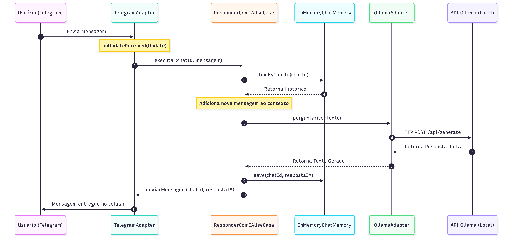

# Ollama Telegram Spring Boot Starter 🤖

Uma biblioteca Spring Boot (Starter) para criar bots de Telegram inteligentes e com memória de contexto, usando a IA local do Ollama de forma simples e rápida.

## 📦 Instalação

Adicione a dependência no seu `pom.xml`:

``` xml
<dependency>
    <groupId>io.github.darkartsbm</groupId>
    <artifactId>ollama-telegram-spring-boot-starter</artifactId>
    <version>1.0.2</version>
</dependency>
```

## ⚠️ Nota sobre o Ciclo de Vida
``` xml
Como este Starter utiliza Long Polling, 
o Spring Boot pode encerrar a aplicação logo após o início por não detectar um servidor web ativo.

Para manter o bot rodando, você tem duas opções:

Modo Web (Recomendado para Iniciantes): Adicione o 

<dependency>
    <groupId>org.springframework.boot</groupId>
    <artifactId>spring-boot-starter-web</artifactId>
</dependency> 

Isso subirá um servidor Tomcat embutido que manterá a aplicação viva.

Modo Light (Recomendado para Performance): Não adicione o starter web. 
Apenas configure spring.main.keep-alive=true no seu application.properties. 
Isso manterá o bot ativo consumindo muito menos memória RAM.
```

## 📖 Como Usar

Configure suas credenciais e a URL do Ollama no seu arquivo application.properties:

Como pegar suas credenciais do Telegram:

Fale com o @BotFather e digite /start.

Na tela de opções, digite /newbot.

Digite o nome que você quer dar ao seu bot (esse nome será o seu USERNAME).

Logo após você decidir seu Username, ele lhe mandará uma chave de API neste formato: 123146612:HUHSAv...

O seu TOKEN é exatamente essa chave gerada.

Adicione as configurações abaixo no seu projeto:
```
application.porperties

# --- Configurações do Telegram ---
meubot.telegram.token=SEU_TOKEN_AQUI
meubot.telegram.username=NOME_DO_SEU_BOT

# --- Configurações da IA (Ollama) ---
meubot.ollama.url=http://localhost:11434/api/chat
meubot.ollama.model=llama3.2:1b

> **Obs:** Preferi deixar o `llama3.2:1b` como padrão por ser leve e funcional, mas sinta-se livre para usar qualquer modelo que você baixar, basta alterar o parâmetro no seu arquivo de configurações.

2. Pronto! A biblioteca já configura automaticamente a conexão com o Telegram, gerencia a memória das conversas por usuário e responde utilizando o modelo de IA escolhido. Basta rodar sua aplicação Spring Boot!

3. Memória Persistente (Opcional):
O bot já está configurado para aceitar uma interface que comporte o seu banco de dados, caso você queira implementar uma memória persistente a longo prazo em vez da memória em RAM padrão.

Requisitos
Java 17 ou superior

Spring Boot 3.x

Ollama rodando localmente ou via Docker


---


```
## 🖥️ Arquitetura 

A biblioteca utiliza **Arquitetura Hexagonal**, o que separa a lógica de IA e o Gerenciamento de Memória das plataformas externas (Telegram/Ollama). Isso permite que você substitua a memória RAM por um Banco de Dados apenas implementando uma interface, sem tocar no código do Starter.

## 📚 Fluxo de Dados



## 🛠️ Customização de Memória (Persistência)

Por padrão, as conversas são salvas em **RAM** (perdem-se ao reiniciar). Para usar um banco de dados (MySQL, PostgreSQL, etc.):
1. Implemente a interface `ChatMemoryRepository` no seu projeto.
2. Crie a lógica de salvar e buscar do seu banco de dados nesta classe.
3. Marque sua classe com `@Primary` ou `@Component`.
   O Spring substituirá automaticamente a memória padrão pela sua versão de banco de dados.

## 📝 Licença
Distribuído sob The Apache License, Version 2.0.


